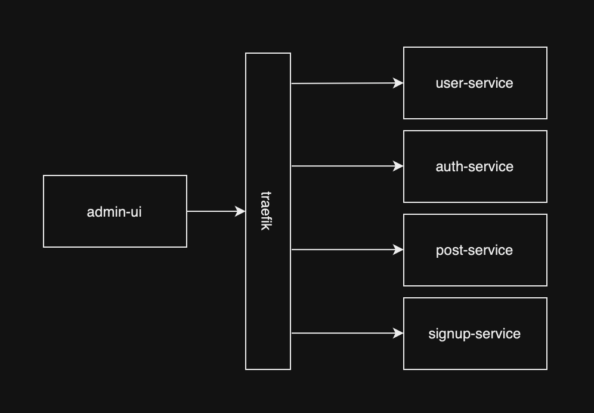
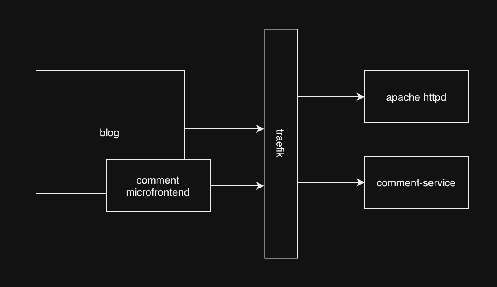
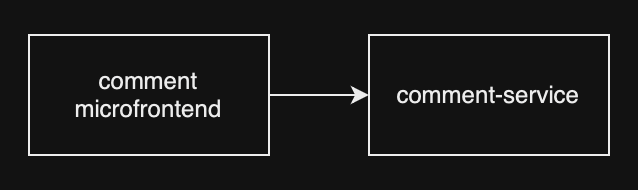

# Blog Manager

### Dependencies

- Docker
- Docker Compose v2
- (optional) Node 18.x (for running tests)

### Running the project

```
git clone https://github.com/Npfries/blog-manager.git
```

```
cd blog-manager
```

```
docker compose up -d
```

Add the following host names to your `/etc/hosts` file (or dnsmasq config, or platform specific hosts config)

```
127.0.0.1	post-service.localhost.com
127.0.0.1	user-service.localhost.com
127.0.0.1	auth-service.localhost.com
127.0.0.1	signup-service.localhost.com
127.0.0.1	admin.localhost.com
127.0.0.1	blog.localhost.com
127.0.0.1   comment-mfe.localhost.com
127.0.0.1   comment-service.localhost.com
```

The admin dasboard login/signup page should be accessible at `http://admin.localhost.com`

### Executing the test suite

```
npm run test
```

\*this will execute `npm run test` in each of packages in `/apps` and `/lib`. Many of the packages do not contain tests.

### Architecture

A high priority was placed on resillience of the architecture over simplicity. It was designed to continue to provide a usable, but degraded, experience in many failure scenarios. This was also an opportunity to explore some methodologies relatively new to me and create a learning experience.

An event driven microservice architecture was chosen over a monolithic architecture, though that may have been a more appropriate choice depending on the theoretical needs. A monolithic architecture would have been significantly simpler to maintain, deploy, and operate - at the cost of resillience, flexibility in feature development, and capacity for multi-team ownership.

The application consists of two largely independent systems of services, the blog system, and the admin system. The two systems can operate independently, relying on events (rabbitmq) to communicate state updates and allow consumer services to react accordingly. Service-to-service http requests are allowed when they are 1. unidirectional, and 2. a single service deep, otherwise, asynchronous events should be utilized, necessitating eventual-consistency tolerance.

#### Admin system

The admin system consists of a single user interface, a signup service, a user service, an auth service, and a post service.



#### Blog system

The blog system consists of two user interfaces, the blog site, the comment microfrontend, and the comment microservice. Each can be independently developed and deployed.



The blog site is served from Apache httpd, utilizing the the /usr/local/htdocs as a stand-in blob store. This was chosen for SEO and operational simplicity. Each blog post is completely static, not requiring any Javascript to load, and could be replicated globally via a CDN. While a SSR solution would yield many of the same benefits, it would come at the cost of deployment and operational complexity. Ideally in a production setting this would be another static file server, with contents replicated to, and served from, a CDN, such as Amazon S3 -> Cloudfront.

The comments microfrontend is a React application that is lazy-loaded at runtime by the blog site. It communicates with the comment service via REST endpoints. The comment feature is largely CRUD, with the exception of delete, as child comments would lose referential integrity and could be orphaned, so comment content is removed and the comment is anonymized.

The comment microfrontend can be developed and tested independently from the blog site at `http://comment-mfe.localhost.com`



The entire comment feature is represnted in this diagram. The only soft dependency is that the microfrontend host (the blog site in this case) provides the blog post slug to the comment microfrontend, so that it can associate comments to individual blog posts.

TODO:

- Rewrite as a monolithic Next.js application (I jest, but really, this would've saved considerable time and effort, though I don't think it would've provided nearly the same learning experience)

Known security issues:

- JWT stored in localstorage
- refresh_token not implemented
- Placeholder secrets stored in .env files
- Symmetrical JWT secrets shared among services
- Naive or lacking sanitization of user input in several locations

Potential future security improvements considered:

- Implement asymmetrical algorithms for JWT auth (private/public key)
- Implement refresh_token and store JWT in memory only
- Implement a secrets store (perhaps in CI/CD pipeline, or at deployment to ECS, EKS, etc.)
- Unnecessary reloads in admin page to fetch state updates (such as on post creation / edit)
- Improve sanitization and validation of user input
