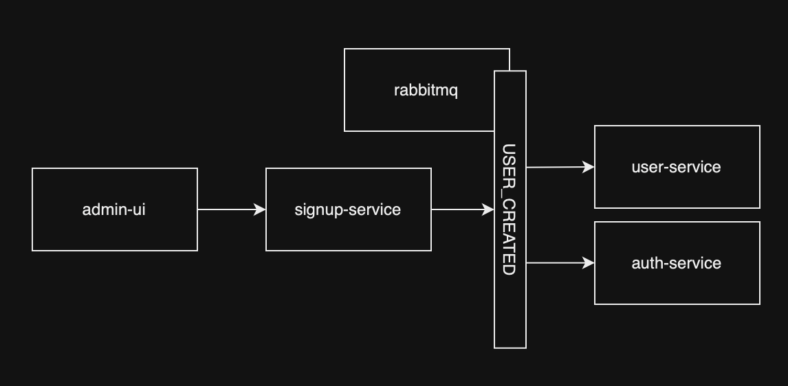
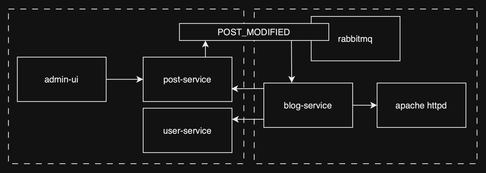

# Blog Manager

A blog management platform utilizing an event-driven microservice architecture written in Javascript.

## Setup

### Dependencies

- Docker
- Docker Compose v2
- (optional) Node 18.x (for running tests)

### Running the project

```
git clone https://github.com/Npfries/blog-manager.git
```

```
cd blog-manager
```

```
docker compose up -d
```

Add the following host names to your `/etc/hosts` file (or dnsmasq config, or platform specific hosts config)

```
127.0.0.1    post-service.localhost.com
127.0.0.1    user-service.localhost.com
127.0.0.1    auth-service.localhost.com
127.0.0.1    signup-service.localhost.com
127.0.0.1    admin.localhost.com
127.0.0.1    blog.localhost.com
127.0.0.1    comment-mfe.localhost.com
127.0.0.1    comment-service.localhost.com
```

The admin dasboard login/signup page should be accessible at `http://admin.localhost.com`

### Executing the test suite

```
npm run test
```

\*this will execute `npm run test` in each of packages in `/apps` and `/lib`. Many of the packages do not contain tests. Jest is executed in each service individually, so the test count totals are not accurate with respect to the entire project.

## Architecture

A high priority was placed on resillience of the architecture over simplicity. It was designed to continue to provide a usable, but degraded, experience in many failure scenarios. This was also an opportunity to explore some methodologies relatively new to me and create a learning experience.

An event driven microservice architecture was chosen over a monolithic architecture, though that may have been a more appropriate choice depending on the theoretical needs. A monolithic architecture would have been significantly simpler to maintain, deploy, and operate - at the cost of resillience, flexibility in feature development, and capacity for multi-team ownership.

The application consists of two largely independent systems of services, the blog system, and the admin system. The two systems can operate independently, relying on events (rabbitmq) to communicate state updates and allow consumer services to react accordingly. Service-to-service http requests are allowed when they are 1. unidirectional, and 2. a single service deep, otherwise, asynchronous events should be utilized, necessitating eventual-consistency tolerance.

### Admin system

The admin system consists of a single user interface, a signup service, a user service, an auth service, and a post service. Each microservice can be independently developed and deployed.


The admin dashboard is a React application. It communicates with each microservice via REST endpoints.

Each microservice is a Node.js application using the Fastify framework, with a MariaDB database. Each microservice has a corresponding database with respective naming.

No synchronous service-to-service communication occurs within the admin system. The minimal service-to-service communication that _does_ occur happens via events, utilizing rabbitmq fanout exchanges. Each can be independently developed and deployed.

The user service is responsible for storing and retrieving user information, such as email, name, and user handle.

The auth service is responsible for storing login information and issuing JWTs when valid credentials are provided.

The post service is responsible for storing and retrieving post information, such as title, author and content.

The signup service is responsible for handling the user signup flow. It is a stateless service that does not store any information.

##### Example admin system user flow



This is an example of asynchronous communication in the user signup flow. The admin interface makes a POST request to the signup service, and the signup service publishes an event to the USER_CREATED fanout exchange. The user service and auth service assert individual queues on the exchange. This setup behaves like a pub/sub system.

### Blog system

The blog system consists of two user interfaces, the blog site, the comment microfrontend, and the comment microservice. Each can be independently developed and deployed.


The blog site is served from Apache httpd, utilizing the the /usr/local/htdocs as a stand-in blob store. This was chosen for SEO and operational simplicity. Each blog post is completely static, not requiring any Javascript to load, and could be replicated globally via a CDN. While a SSR solution would yield many of the same benefits, it would come at the cost of deployment and operational complexity. Ideally in a production setting this would be another static file server, with contents replicated to, and served from, a CDN, such as Amazon S3 -> Cloudfront.

The comments microfrontend is a React application that is lazy-loaded at runtime by the blog site. It communicates with the comment service via REST endpoints. The comment feature is largely CRUD, with the exception of delete, as child comments would lose referential integrity and could be orphaned, so comment content is removed and the comment is anonymized.

The comment service is a Node.js application using the Fastify framework, with a MariaDB database.

The comment microfrontend and comment service can be developed and tested independently from the blog site at `http://comment-mfe.localhost.com`

##### Example blog system user flow


The entire comment feature is represnted in this diagram. The only soft dependency is that the microfrontend host (the blog site in this case) provides the blog post slug to the comment microfrontend, so that it can associate comments to individual blog posts.

### How the systems work together



\*admin system represented in the dashed area on the left, blog system on the right

When a post is published or modified, the post services publishes an event to the POST_MODIFIED exchange, which is consumed by the blog service. When the blog service consumes an event, it fetches the post information from the post service, and fetches (public) author information from the user service.

While the post information could be included in the event, posts are of unknown size, and could be subject to change in the future. In order to minimize memory pressure on rabbitmq, only the post ID is sent in the event. In addition, the post service does not contain author information other than by reference, so the blog service would still need to fetch the author information from user service in either case.

Once the blog service has assembled the necessary information from the post service and the user service, it "publishes" the post by storing a static HTML file in the `/usr/local/apache2/htdocs/` directory of the running httpd service in a subdirectory matching the pattern of /<user_handle>/<post_title> so httpd can servce the static blog post at the URL `http://blog.localhost.com/<user_handle>/<post_title>`.

The code for generating the slug for the blog post is shared between the admin interface and the blog service, so the admin dashboard can eagerly display a link to the blog post without requiring a notification from the blog service.

### Observability

- Jaeger web UI is available at `http://localhost:16686`
- Duplicate GET requests in Jaeger
  - docker-compose.yml is configured to target the `dev` stage of each Dockerfile
  - React.StrictMode is enabled
  - This leads to duplicate GET requests showing up in Jaeger
- Service-to-service http traces are not sent to Jaeger
  - This is a bug
  - Two known specific traces are missing
    - blog-service -> user-service GET
    - blog-service -> post-service GET
- Service-to-service amqp traces are sent to Jaeger (which is most of them)

### Notes

Todo:

- Rewrite as a monolithic Next.js application (I jest, but really, this would've saved considerable time and effort, though I don't think it would've provided nearly the same learning experience)

Known security issues:

- JWT stored in localstorage
- refresh_token not implemented
- Placeholder secrets stored in .env files
- Symmetrical JWT secrets shared among services
- Naive or lacking sanitization of user input in several locations
- Post slugs may not be URL-safe

Potential future security improvements considered:

- Implement asymmetrical algorithms for JWT auth (private/public key)
- Implement refresh_token and store JWT in memory only
- Implement a secrets store (perhaps in CI/CD pipeline, or at deployment to ECS, EKS, etc.)
- Unnecessary reloads in admin page to fetch state updates (such as on post creation / edit)
- Improve sanitization and validation of user input

Omitted:

- User input sanitization
- Comment feature auth
- API validation
- Error handling
- User input validation
- Deployment steps
- Typescript
- Integration tests
- CI/CD pipeline
- Blog homepage
- Blog analytics
